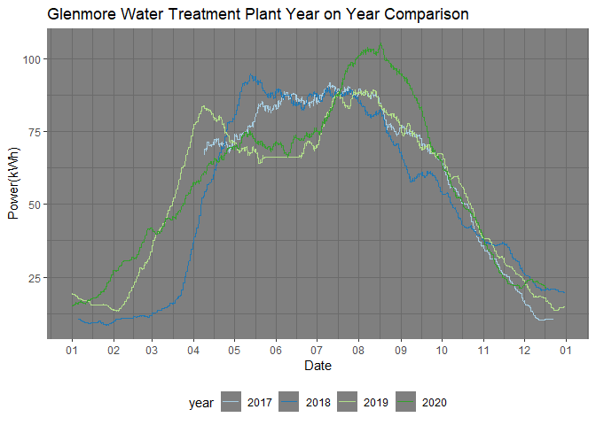

# Exploratory Analysis of City Run Distributed Solar Power Production Sites in Calgary

download solar energy production from Open Calgary data portal 
https://data.calgary.ca/Environment/Solar-Energy-Production/ytdn-2qsp

```r
citysolar <- read.csv("./Solar_Energy_Production.csv")
```
## Explore the data

```r
str(citysolar)
```

```
## 'data.frame':	169785 obs. of  5 variables:
##  $ name   : chr  "Southland Leisure Centre" "Southland Leisure Centre" "Southland Leisure Centre" "Southland Leisure Centre" ...
##  $ id     : int  164440 164440 164440 164440 164440 164440 164440 164440 164440 164440 ...
##  $ address: chr  "2000 SOUTHLAND DR SW" "2000 SOUTHLAND DR SW" "2000 SOUTHLAND DR SW" "2000 SOUTHLAND DR SW" ...
##  $ date   : chr  "2017/01/02 11:00:00 AM" "2017/01/02 12:00:00 PM" "2017/01/02 01:00:00 PM" "2017/01/03 11:00:00 AM" ...
##  $ kWh    : num  0 0 0 0 0 0 0 0 0 0 ...
```

```r
names <- table(citysolar$name) ##investigate how many solar sites
namesDF <- as.data.frame(names)
namesDF
```

```
##                                         Var1  Freq
## 1             Bearspaw Water Treatment Plant 15593
## 2             Calgary Fire Hall Headquarters 16684
## 3                            CFD Firehall #7 13629
## 4  City of Calgary North Corporate Warehouse 18007
## 5             Glenmore Water Treatment Plant 17077
## 6  Hillhurst Sunnyside Community Association 15849
## 7                      Manchester Building M 13517
## 8        Richmond - Knob Hill Community Hall 17610
## 9                   Southland Leisure Centre 23144
## 10                               Telus Spark   317
## 11            Whitehorn Multi-Service Centre 18358
```

#### Check for missing data

```r
citysolar$date <- as.POSIXct(citysolar$date, format = "%Y/%m/%d %I:%M:%S %p") ##type str to date
colSums(is.na(citysolar)) ## check for missing data
```

```
##    name      id address    date     kWh 
##       0       0       0       0       0
```
#### Check for data sampling interval

```r
library(dplyr)
citysolar <- group_by(citysolar, name)
citysolar <- arrange(citysolar, date) ##sort grouped data by date
head(citysolar) ##indicates hourly measurements
```

```
## # A tibble: 6 x 5
## # Groups:   name [1]
##   name                         id address              date                  kWh
##   <chr>                     <int> <chr>                <dttm>              <dbl>
## 1 Southland Leisure Centre 164440 2000 SOUTHLAND DR SW 2015-09-01 14:30:00 27.8 
## 2 Southland Leisure Centre 164440 2000 SOUTHLAND DR SW 2015-09-01 15:30:00 30.6 
## 3 Southland Leisure Centre 164440 2000 SOUTHLAND DR SW 2015-09-01 16:30:00 23.6 
## 4 Southland Leisure Centre 164440 2000 SOUTHLAND DR SW 2015-09-01 17:30:00 15.3 
## 5 Southland Leisure Centre 164440 2000 SOUTHLAND DR SW 2015-09-01 18:30:00  7.90
## 6 Southland Leisure Centre 164440 2000 SOUTHLAND DR SW 2015-09-01 19:30:00  1.88
```

## Seasonal Variation in Solar Power Production at City Run Distributed Solar Sites
First apply a 30day moving average to the data to get a general sense of power production trends throughout the year. Seasonal variation in solar power production (high in the summer, low in the winter) is obvious for all the sites shown.

Use a 30 day window for the moving average. Because the data is sampled in hours we use k = 720 to get 30 day moving average (24hours * 30 days = 720)
check for any rows with missing data introduced by rollmean() and remove them.

```r
library(zoo)
citysolar <- mutate(citysolar, MA30day = rollmean(kWh, k = 720, fill = NA))
colSums(is.na(citysolar))
```

```
##    name      id address    date     kWh MA30day 
##       0       0       0       0       0    7507
```

```r
citysolar <- citysolar[complete.cases(citysolar),]
colSums(is.na(citysolar))
```

```
##    name      id address    date     kWh MA30day 
##       0       0       0       0       0       0
```

#### Create plot

```r
library(ggplot2)
g <- ggplot(citysolar, aes(date, MA30day, group = name, colour = name)) + geom_line() +
  scale_color_brewer(palette = "Paired") + theme_dark() + theme(legend.position = "bottom") +
  guides(colour = guide_legend(ncol = 2)) + ggtitle("Yearly Solar Power Production Trends") + xlab("Date") +
  ylab("Power(kWh)")
g
```

<!-- -->

# Glenmore Water Treatment Plant in Detail
Take a closer look at the data for the Glenmore Water Treatment Plant to investigate smaller scale trends in solar power production at this location.

```r
glenmore <- citysolar %>% filter(name == "Glenmore Water Treatment Plant")
g_glenmore <- ggplot(glenmore, aes(date, MA30day)) + geom_line(colour = "#FB9A99") +
  theme_dark() + theme(legend.position = "bottom") +
  guides(colour = guide_legend(ncol = 2)) + ggtitle("Glenmore Water Treatment Plant Solar Power Production") + xlab("Date") +
  ylab("Power(kWh)")
g_glenmore
```

<!-- -->

## Year on Year Comparison 

Plot the 4 years of available data against eachother to see if there are any significant differences in solar power production from year to year.


```r
glenmore_yearly <- glenmore %>% mutate(year = format(date,"%Y"), month_day = format(date, "%m-%d %I:%M:%S %p"))
glenmore_yearly$month_day <- as.Date(glenmore_yearly$month_day, format = "%m-%d %I:%M:%S %p")
g_yearly <- ggplot(glenmore_yearly, aes(month_day, MA30day, group = year, color = year)) + geom_line() +
  theme_dark() + theme(legend.position = "bottom") +  scale_color_brewer(palette = "Paired") +
  ggtitle("Glenmore Water Treatment Plant Year on Year Comparison") + xlab("Date") + ylab("Power(kWh)") + scale_x_date(date_labels = "%m", date_breaks = "1 month")
g_yearly
```

<!-- -->

## Daily Cyclicity in Solar Power Production at Glenmore Water Treatment in July 

Select rows for one week in July, Look at hourly readings rather than 30day rolling average so we can see the finer grained cyclicity. Diurnal cyclicity (high production at noon, no production at night) is clearly visible

```r
glenmore2018 <- glenmore %>% filter(date >= "2018-07-01" & date <= "2018-07-08")
##glenmore2018$date <- as.Date(glenmore2018$date)
g2018 <- ggplot(glenmore2018, aes(date, kWh)) + geom_line(colour = "#FB9A99") +
  theme_dark() + theme(legend.position = "bottom") +
  guides(colour = guide_legend(ncol = 2)) + ggtitle("Glenmore Water Treatment Plant 2018 Solar Power Production") + xlab("Date") + ylab("Power(kWh)")
g2018
```

<!-- -->

# Explore power consumption at city run distributed solar sites
<span style="color:red">**THIS SECTION STILL UNDER CONSTRUCTION**</span>

```r
EnCons <- read.csv("./Corporate_Energy_Consumption.csv")
```
#### Types of energy consumption at city sites

```r
EnergyTypes <- table(EnCons$Energy.Description)
EnergyTypesDF <- as.data.frame(EnergyTypes)
EnergyTypesDF
```

```
##              Var1   Freq
## 1 District Energy    309
## 2     Electricity 109896
## 3     Natural Gas  35865
## 4     Solar Power    969
## 5   Solar Thermal     68
```
#### Select solar energy consumption only

```r
SolarCons <- subset(EnCons, Energy.Description == "Solar Power")
```


